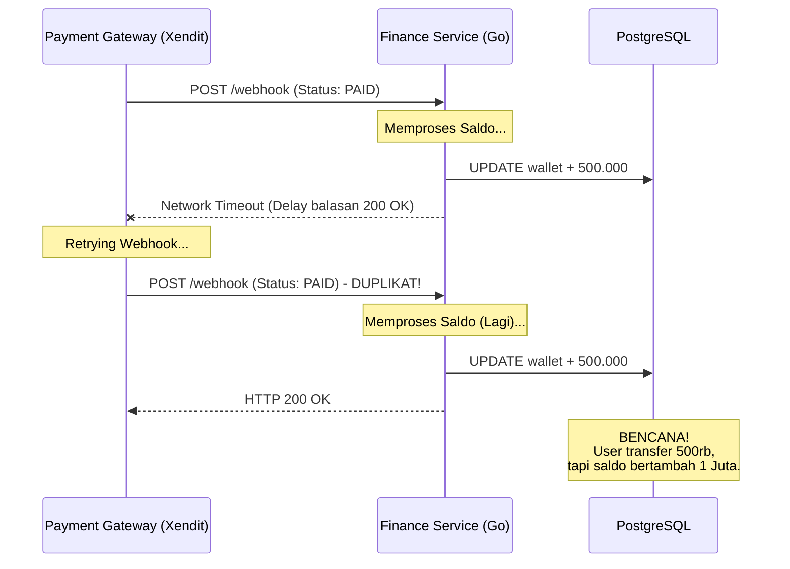
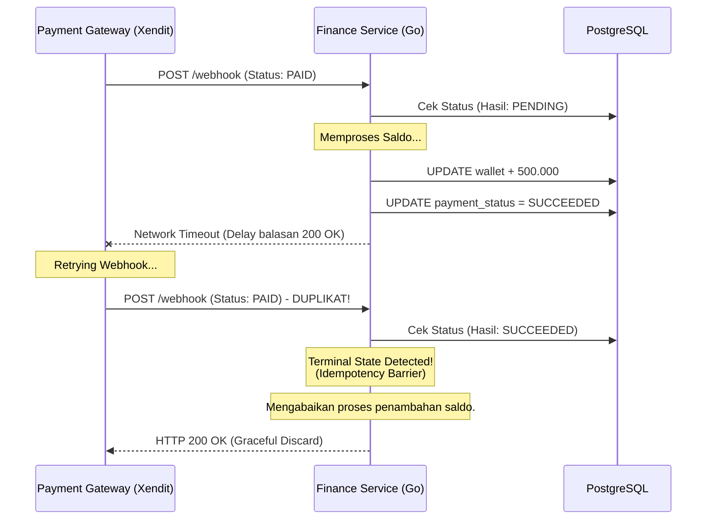

#  Resiliensi Integrasi Sistem Eksternal (Idempotency)

Dalam ekosistem *microservices* modern, kita tidak hidup sendirian. GNEXA harus berkomunikasi dengan sistem pihak ketiga, seperti *Payment Gateway* (Xendit) untuk memproses pembayaran Virtual Account. Namun, berkomunikasi melintasi internet publik membawa satu risiko mutlak: **Jaringan tidak pernah 100% stabil**.

**Tantangan Terbesar: Fault Tolerance (Toleransi Kegagalan)** Kegagalan jaringan, *timeout*, atau lonjakan *traffic* sering kali memicu sistem eksternal untuk melakukan pengiriman ulang (*network retries*). Jika Xendit tidak menerima balasan `HTTP 200 OK` dari GNEXA dalam beberapa detik, mereka akan berasumsi bahwa *webhook* gagal terkirim dan akan mengirim ulang *payload* yang sama. Tanpa penanganan yang tepat, duplikasi *webhook* ini bisa mengakibatkan "injeksi saldo ganda" pada dompet pengguna atau duplikasi pemrosesan pesanan.

---

### A. Bencana Tanpa Idempotency (The Double-Spending Trap)

Mari kita lihat apa yang terjadi jika sistem menelan mentah-mentah semua *webhook* yang masuk. Seorang *user* mentransfer Rp 500.000 ke Virtual Account GNEXA. Xendit mengirim notifikasi sukses, tetapi karena ada sedikit *delay* jaringan, Xendit mengirimnya lagi 5 detik kemudian.



:::danger Celah Fatal
Sistem yang naif memproses *business logic* (penambahan saldo) murni berdasarkan *payload* yang masuk, tanpa mengingat apa yang sudah terjadi di masa lalu.
:::

---

### B. Solusi: Idempotency Logic & State Verification

Untuk membangun sistem yang toleran terhadap kegagalan jaringan (*fault-tolerant*), *Finance Service* GNEXA merancang **Idempotency Logic** yang ketat pada *usecase layer*. 

Idempotensi adalah konsep matematika dan ilmu komputer di mana sebuah operasi dapat diterapkan berkali-kali tanpa mengubah hasil di luar penerapan pertamanya. Di GNEXA, ini diimplementasikan melalui **State Verification**:

1. **State Machine Check:** Setiap *incoming payload webhook* tidak langsung dieksekusi, melainkan diverifikasi terlebih dahulu terhadap *state machine* (status transaksi) di *database*.
2. **Terminal State Check:** Sistem mengecek apakah `transaction_id` tersebut sudah berada di status terminal (`SUCCEEDED` atau `FAILED`).
3. **Graceful Discard:** Jika transaksi sudah berstatus terminal, *webhook* susulan akan dibuang secara aman. Sistem tidak memproses penambahan saldo lagi, tetapi **tetap mengembalikan `HTTP 200 OK`** ke Xendit agar mereka berhenti melakukan *retry*.

#### Implementasi Logika (Ilustrasi)

```go
// 1. Cek status transaksi saat ini di Database
var payment Payment
db.Where("transaction_id = ?", payload.ID).First(&payment)

// 2. Terminal State Check (Idempotency Barrier)
if payment.Status == "SUCCEEDED" {
    // 3. Graceful Discard: Kembalikan 200 OK tanpa memproses ulang
    return c.JSON(http.StatusOK, map[string]string{
        "message": "Webhook already processed",
    })
}

// 4. Lanjutkan proses jika status masih PENDING
processTopUp(payment.UserID, payload.Amount)
updatePaymentStatus(payload.ID, "SUCCEEDED")
return c.JSON(http.StatusOK, "Success")
```

---

### C. Visualisasi Penyelamatan dengan Idempotency

Dengan benteng *Idempotency* yang sudah terpasang, mari kita hadapi skenario *network timeout* dari Xendit sekali lagi:



:::success Jaminan Integritas Finansial
Mekanisme pertahanan berlapis ini berfungsi sebagai tameng utama dalam **Double-Spending Prevention**. Sebanyak apa pun Xendit atau pihak ketiga membombardir *endpoint webhook* dengan *payload* yang sama, GNEXA akan menanganinya dengan tenang, memastikan saldo pengguna bertambah secara akurat, dan menjamin integritas finansial sistem secara keseluruhan.
:::