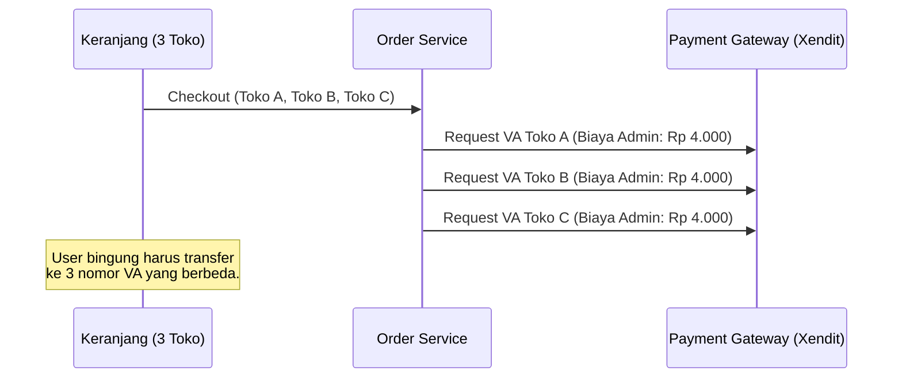
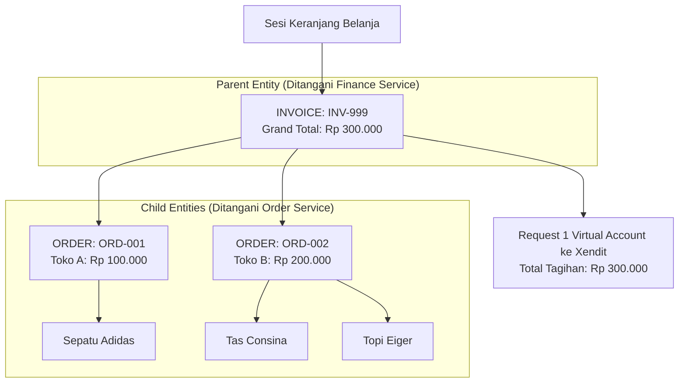

#  Agregasi Pembayaran Multi-Tenant (Parent-Child Mapping)

Karakteristik utama dari platform *multi-seller* seperti GNEXA adalah kebebasan pengguna untuk berbelanja dari berbagai toko yang berbeda dalam satu kali sesi keranjang belanja. Hal ini menciptakan kompleksitas data transaksi yang sangat tinggi di sisi *backend*.

**Tantangan Terbesar: Multi-Seller Checkout** Jika seorang pengguna membeli tiga barang dari tiga toko yang berbeda, bagaimana kita menagih pembayarannya? Melakukan *HTTP request* ke *Payment Gateway* (seperti Xendit) untuk memproses *setiap* pesanan secara terpisah adalah sebuah "bencana arsitektur".

---

### A. Anti-Pattern: Bencana Tanpa Order Grouping

Bayangkan jika *Order Service* kita dirancang secara naif dengan memetakan 1 Pesanan = 1 Pembayaran ke Xendit. 

:::danger Degradasi UX & Overhead Biaya
Pendekatan ini menghasilkan dua masalah fatal:
1. **User Experience (UX) Hancur:** Pengguna harus melakukan transfer tiga kali ke tiga nomor Virtual Account yang berbeda untuk satu kali belanja. Sangat merepotkan.
2. **Overhead Biaya Tinggi:** Perusahaan harus membayar biaya admin *payment gateway* (misal: Rp 4.000 per VA) sebanyak tiga kali (Total Rp 12.000), yang menggerus margin keuntungan secara signifikan.
:::

---

### B. Solusi: Order Grouping & Parent-Child Mapping

GNEXA memecahkan masalah ini dengan teknik **Order Grouping** di dalam *Order Service* (NestJS). Sistem menggunakan pendekatan relasional *Parent-Child* untuk membungkus banyak pesanan ke dalam satu entitas penagihan.

1. **Invoice Wrapper (Parent):** Sistem secara dinamis membuat satu entitas Induk bernama `InvoiceID`. Ini adalah *wrapper* atau cangkang utama.
2. **Order Entities (Child):** Pesanan dari tiap-tiap toko dipecah menjadi entitas Anak (`OrderID`) dan diikat di bawah satu `InvoiceID` yang sama.
3. **Grand Total Processing:** Saat dikirim ke Kafka, *Finance Service* (Golang) bertindak murni sebagai pemroses *Grand Total* dari entitas `InvoiceID` tersebut, tanpa perlu mempedulikan rincian toko di dalamnya.

#### Visualisasi Pemetaan Data (Data Mapping)

---

### C. Mekanisme Orkestrasi Multi-Tenant

Dengan struktur data *Parent-Child* di atas, aliran transaksi menjadi sangat elegan dan sangat efisien:

1. Pembeli melakukan *checkout*. *Order Service* menyusun hierarki `Invoice` dan `Order` di dalam PostgreSQL menggunakan *database transaction* tunggal (`prisma.$transaction`).
2. *Order Service* mengirimkan satu *event* ke Kafka: `invoice.created` dengan *payload Grand Total*.
3. *Finance Service* menerima *event* tersebut, lalu meminta **hanya SATU nomor Virtual Account** ke Xendit. Biaya admin hanya dibayar satu kali.
4. Pembeli mendapatkan satu nomor VA dan membayar dengan mudah.
5. Saat pembayaran sukses, *Finance Service* mempublikasikan `payment.success`. *Order Service* mendengarnya dan langsung mengubah status `Invoice` beserta seluruh `Order` di dalamnya menjadi `PAID` secara serentak.

:::success Efisiensi Transaksi Maksimal
Teknik **Order Grouping** ini menghasilkan efisiensi tingkat tinggi. Tidak peduli pembeli *checkout* dari 1 toko atau 50 toko sekaligus, sistem hanya akan memproses 1 kali pemanggilan *payment gateway*, menagih 1 kali biaya admin, dan memberikan 1 pengalaman pembayaran yang mulus (*seamless UX*) bagi pengguna.
:::