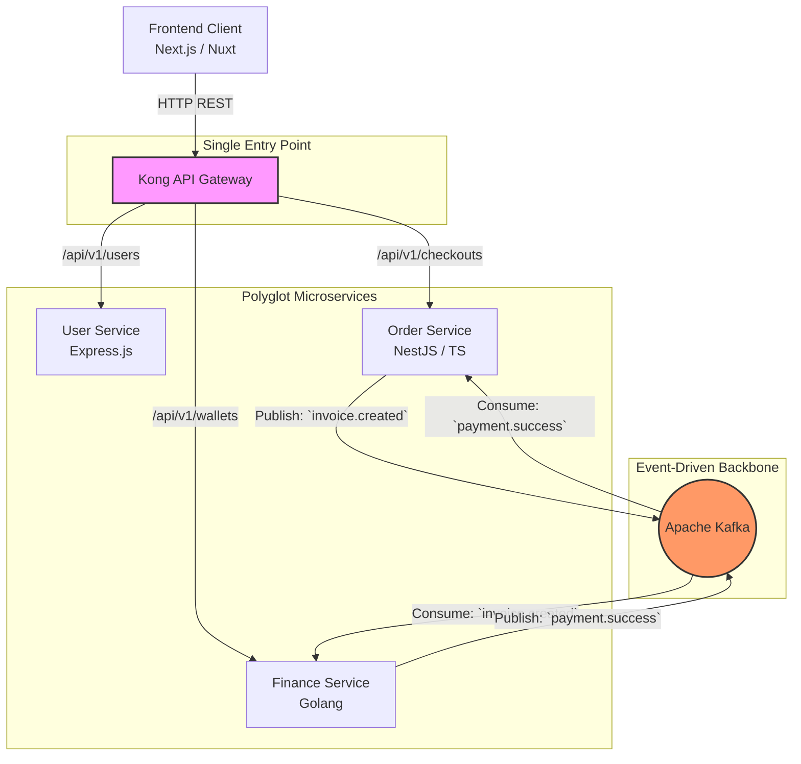

# Interoperabilitas Komunikasi Polyglot (Cross-Service Orchestration)

Sebagai sebuah *project portfolio* yang eksperimental, GNEXA sengaja dirancang menggunakan **Arsitektur Polyglot**. Sistem ini menyatukan ekosistem bahasa pemrograman dan *framework* yang sepenuhnya berbeda untuk menangani domain spesifiknya masing-masing:
* **Golang** (Finance Service): Menangani komputasi finansial yang membutuhkan performa dan konkurensi tinggi.
* **TypeScript / NestJS** (Order Service): Menangani struktur data relasional (keranjang & pesanan) dengan paradigma OOP (*Object-Oriented Programming*).
* **JavaScript / Express.js** (User Service): Menangani sistem identitas dan autentikasi yang ringan dan cepat.

**Tantangan Terbesar: Data Mismatch & API Contracts** Menyatukan layanan yang berbicara dengan "bahasa" berbeda membawa risiko besar. Bagaimana jika *Finance Service* (Go) mengharapkan tipe data `int64` untuk harga, tetapi *Order Service* (Node.js) mengirimkannya sebagai `string`? Selain itu, membiarkan *Frontend* berinteraksi langsung dengan banyak *server* berbeda akan menciptakan mimpi buruk manajemen URL dan CORS (*Cross-Origin Resource Sharing*).

---

### A. Anti-Pattern: Spaghetti Architecture

Tanpa orkestrasi yang jelas, komunikasi antar-servis akan membentuk jaring laba-laba yang rumit (*Spaghetti Architecture*). 

* *Frontend* harus menghafal URL *User Service* (`:3001`), *Order Service* (`:3002`), dan *Finance Service* (`:3003`).
* Jika *User Service* mati, *Frontend* mungkin baru menyadarinya setelah aplikasi *crash*.
* Komunikasi langsung HTTP antar-servis (*Synchronous Service-to-Service*) akan membuat seluruh sistem melambat jika salah satu servis mengalami *delay* jaringan.

---

### B. Solusi: Kong Gateway, Kafka & Strict JSON Contracts

GNEXA memecahkan kerumitan komunikasi *polyglot* ini dengan memisahkan jalur komunikasi menjadi dua jenis: **Sinkron (REST API)** untuk interaksi dengan pengguna, dan **Asinkron (Event-Driven)** untuk interaksi antar-mesin.

#### 1. Kong API Gateway (Synchronous Routing)
Sistem menempatkan **Kong API Gateway** sebagai *Single Entry Point* (Pintu Masuk Tunggal) yang berhadapan langsung dengan *Frontend* atau *Client*.
* *Frontend* tidak perlu tahu ada berapa banyak *microservices* di belakang. Ia cukup menembak satu *base URL* (misal: `api.gnexa.com`).
* Kong bertugas melakukan *routing* permintaan masuk secara cerdas (misal: `/users` diarahkan ke Express, `/checkouts` diarahkan ke NestJS).

#### 2. Apache Kafka (Asynchronous Backbone)
Untuk komunikasi antar-servis di belakang layar, GNEXA tidak menggunakan HTTP REST API (kecuali untuk validasi yang sangat mendesak seperti cek saldo). Sistem menggunakan **Apache Kafka** sebagai *Message Broker*.
* Menyediakan **Guaranteed Delivery**: Jika *Order Service* sedang *down*, pesan dari *Finance Service* tidak akan hilang. Kafka akan menyimpannya dan mengirimkannya saat NestJS menyala kembali.
* *Decoupling*: Golang tidak perlu tahu di mana IP *address* NestJS berada, ia hanya perlu berteriak ke *topic* Kafka.

#### 3. Strict JSON Schema (The Universal Language)
Untuk mencegah *mismatch* tipe data antar bahasa pemrograman, semua layanan mematuhi **API Contracts** yang ketat menggunakan format *payload* JSON yang telah distandardisasi. JSON menjadi "Bahasa Universal" yang dipahami oleh Go, TypeScript, dan JavaScript.

---

### C. Visualisasi Topologi Komunikasi Polyglot

Berikut adalah diagram bagaimana GNEXA mengorkestrasi ekosistem *polyglot* dari hulu (*Client*) hingga ke hilir (*Message Broker*):

:::success Harmoni Dalam Keberagaman
Melalui perpaduan Kong API Gateway di garis depan dan Apache Kafka di garis belakang, GNEXA membuktikan bahwa arsitektur *polyglot* dapat berjalan selaras. Sistem menjadi sangat tangguh, mudah diskalakan, dan tim *developer* memiliki kebebasan absolut untuk menggunakan alat terbaik (*best tool for the job*) untuk memecahkan spesifik domain masalah.
:::