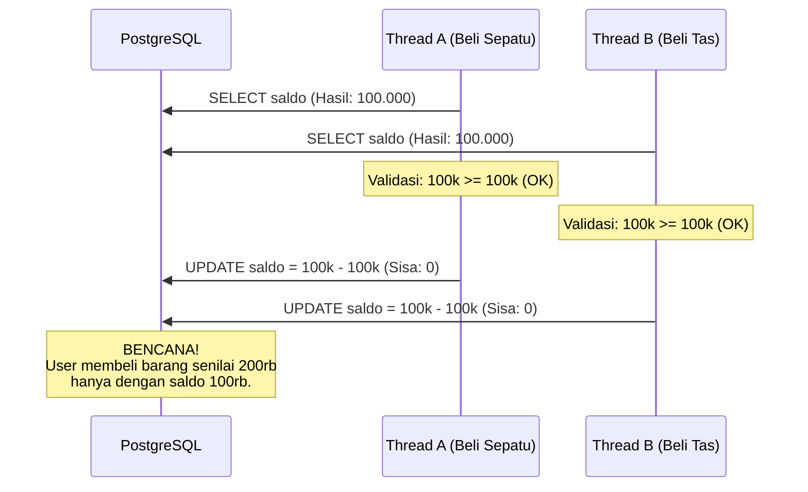
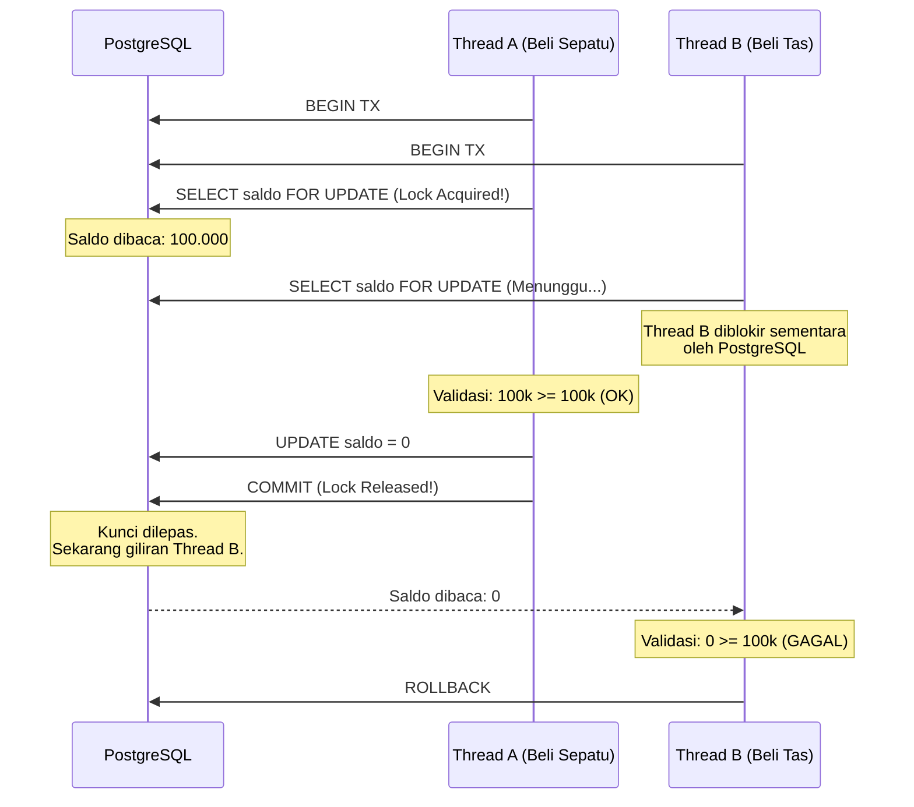

#  Mitigasi Race Condition pada Mutasi Finansial

Fitur dompet digital (GNEXA Wallet) adalah jantung finansial dari platform ini. Berurusan dengan uang digital berarti kita harus siap menghadapi anomali konkurensi (benturan data) yang sangat berbahaya, salah satunya adalah ancaman *Double-Spending*.

**Tantangan Terbesar: Concurrency Control** Di dunia nyata, pengguna bisa saja melakukan *request* secara simultan dalam fraksi milidetik (misalnya, menekan tombol *checkout* berulang kali saat koneksi lambat, atau membuka dua *tab browser* secara bersamaan). Tanpa kontrol konkurensi yang ketat, dua transaksi yang masuk nyaris bersamaan bisa membaca saldo awal yang sama sebelum salah satunya sempat diperbarui. Hasilnya? Perhitungan saldo menjadi kacau, atau lebih parah lagi, saldo pengguna menjadi negatif (minus).

---

### A. Bencana Tanpa Locking (The Race Condition)

Mari kita lihat apa yang terjadi jika sistem tidak memiliki mekanisme *locking*. Bayangkan Tuan A memiliki saldo dompet **Rp 100.000**. Ia mencoba membeli Sepatu (Rp 100.000) dan Tas (Rp 100.000) di milidetik yang sama melalui dua *device* berbeda.



:::danger Fatal Flaw
Inilah yang disebut **Race Condition**. Thread B berhasil "menyalip" dan membaca data usang (*stale data*) karena Thread A belum selesai melakukan penyimpanan (*commit*).
:::

---

### B. Solusi: Pessimistic Locking di Golang

Untuk menjaga atomisitas saldo secara absolut, *Finance Service* GNEXA (yang dibangun dengan Golang) menerapkan mekanisme **Pessimistic Locking** di level *database* PostgreSQL.

Alih-alih berasumsi bahwa benturan data jarang terjadi (Optimistic Locking), sistem secara pesimis mengasumsikan bahwa benturan *pasti* akan terjadi. Oleh karena itu, kita menggunakan perintah SQL `SELECT ... FOR UPDATE`.

* **Row-Level Lock:** Mekanisme ini mengunci spesifik baris data dompet pengguna yang sedang diproses. Baris dompet milik *user* lain tidak akan terpengaruh.
* **Antrean Paksa (Thread Queuing):** Jika ada *thread* lain yang mencoba mengakses baris yang sedang dikunci, PostgreSQL akan memaksa *thread* tersebut untuk mengantre (menunggu) hingga *thread* pertama selesai melakukan `COMMIT` atau `ROLLBACK`.

#### Implementasi Kode (Ilustrasi Golang)

```go
// Memulai Database Transaction
tx := db.Begin()

// Mengunci baris dompet milik user tertentu (Pessimistic Lock)
var wallet Wallet
tx.Raw("SELECT balance FROM wallets WHERE user_id = ? FOR UPDATE", userID).Scan(&wallet)

if wallet.Balance < grandTotal {
    tx.Rollback()
    return errors.New("insufficient balance")
}

// Melakukan pemotongan saldo secara aman
newBalance := wallet.Balance - grandTotal
tx.Exec("UPDATE wallets SET balance = ? WHERE user_id = ?", newBalance, userID)

// Menyelesaikan transaksi dan melepaskan kunci (Release Lock)
tx.Commit()
```

---

### C. Visualisasi Transaksi dengan Pessimistic Locking

Dengan algoritma di atas, mari kita ulangi skenario pembelian Sepatu dan Tas di milidetik yang sama:



:::success Jaminan Integritas Data Tertinggi
Melalui pendekatan ini, kalkulasi mutasi saldo di GNEXA berjalan sepenuhnya absolut (**Atomic Calculation**). Sistem dengan elegan menolak transaksi kedua yang tidak valid, sekaligus menihilkan segala kemungkinan terjadinya *negative balance* (saldo minus) atau anomali mutasi data lainnya.
:::