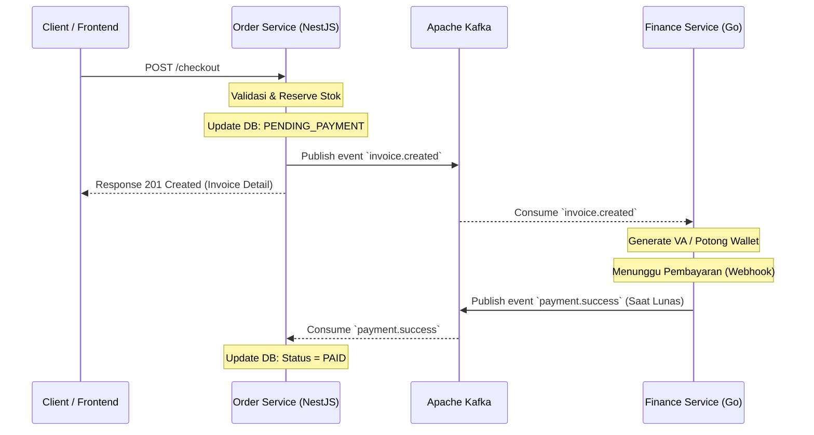
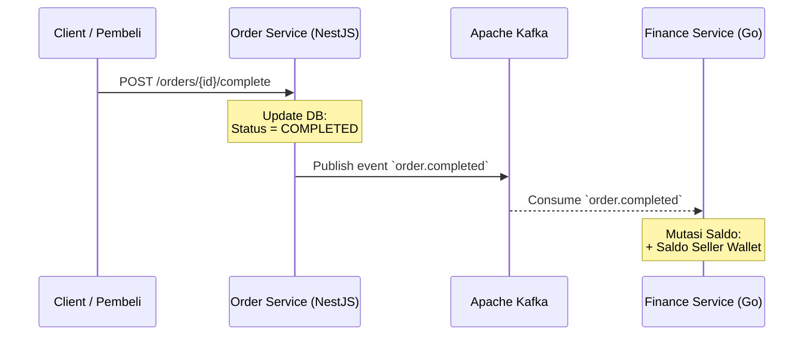
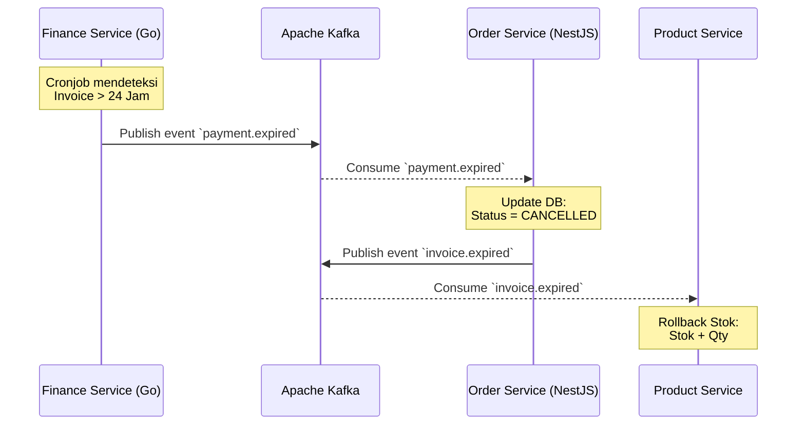
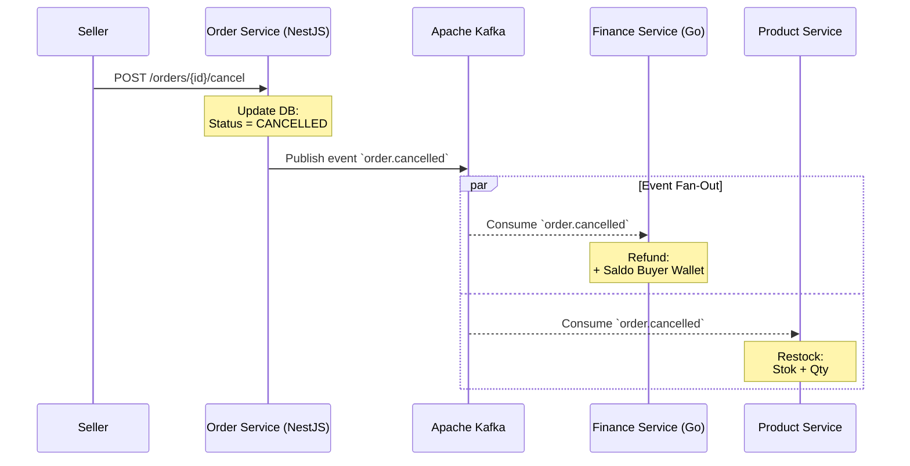

#  Konsistensi Data Lintas Layanan (Saga Pattern)

Dalam arsitektur *microservices*, kita kehilangan kemewahan *single database transaction* (ACID) yang biasanya mengikat seluruh domain dalam satu aplikasi *monolith*. 

**Tantangan Terbesar:** Bagaimana menjaga integritas data saat proses *checkout* melibatkan banyak layanan independen secara bersamaan? Di GNEXA, entitas `Order` hidup di dalam NestJS, sementara `Wallet` dan logika pembayaran dikelola oleh Golang. Jika salah satu gagal, kita tidak bisa sekadar memanggil perintah `ROLLBACK` di *database*.

### Solusi: Saga Pattern (Choreography)

GNEXA memecahkan masalah kompleks ini dengan mengimplementasikan **Saga Pattern** bertipe **Choreography** menggunakan **Apache Kafka** sebagai *message broker*.

* **Asynchronous Workflow:** Jika terjadi kegagalan sistem di tengah jalan atau batas waktu pembayaran Virtual Account habis (24 jam), sistem secara keseluruhan tidak akan *crash* atau *timeout*. 
* **Compensating Transactions:** Sistem akan memicu *event* kompensasi. Jika ada kegagalan, layanan terkait akan mempublikasikan *event* kegagalan yang kemudian didengar oleh layanan lain untuk melakukan *rollback* secara asinkron tanpa memblokir (*non-blocking*) proses lain yang sedang berjalan.

:::success Eventual Consistency
Mekanisme arsitektur *event-driven* ini menjamin bahwa meskipun layanan-layanan GNEXA terpisah secara fisik dan bahasa pemrograman, status akhir sistem akan selalu mencapai titik konsisten yang sama (*eventual consistency*).
:::

---

### A. Visualisasi Alur Transaksi Sukses (Happy Path)

Saga Pattern mengorkestrasi transaksi yang berjalan mulus tanpa membutuhkan *central orchestrator* (pengatur pusat). Layaknya sebuah tarian, setiap layanan bergerak berdasarkan instruksi (*event*) dari Kafka:

### B. Skenario Pesanan Selesai (Payout ke Seller)

Sebagai platform *multi-seller*, dana dari pembeli tidak langsung masuk ke penjual, melainkan ditahan (*escrow*). Mekanisme ini memastikan keamanan bagi kedua belah pihak:

1. **Konfirmasi Penerimaan:** Pembeli menekan tombol "Pesanan Selesai" di aplikasi.
2. **Trigger Event:** Order Service mengubah status pesanan menjadi `COMPLETED` dan mempublikasikan event `order.completed`.
3. **Pencairan Dana (Payout):** Finance Service mendengarkan event tersebut dan mengeksekusi penambahan saldo (mutasi kredit) ke dompet penjual (*Seller Wallet*).

---

### C. Alur Kompensasi: Kedaluwarsa (Expired Rollback)

Berikut adalah visualisasi bagaimana GNEXA memulihkan data stok secara mandiri saat pembeli tidak melakukan pembayaran hingga batas waktu (24 jam) habis:

### D. Alur Kompensasi: Pembatalan & Retur (Refund & Restock)

Bagaimana jika pesanan sudah dibayar (`PAID`), tetapi penjual membatalkan pesanan karena stok fisik ternyata rusak atau kosong? Di sinilah Saga Pattern menunjukkan kehebatannya melalui sistem *fan-out event*:

1. **Trigger Event Pembatalan:** Penjual membatalkan pesanan. Order Service mempublikasikan `order.cancelled`.
2. **Kompensasi Paralel:** Kafka menyiarkan event ini ke banyak layanan sekaligus.
   - **Finance Service** mendengarnya dan melakukan *Refund* (mengembalikan dana utuh ke dompet GNEXA pembeli).
   - **Product Service** mendengarnya dan mengembalikan stok barang ke etalase.

### Kesimpulan Pendekatan Choreography

Dengan menggunakan *Choreography*, GNEXA terhindar dari *Single Point of Failure* (SPOF). Tidak ada satu pun layanan yang menjadi "diktator" atau pengatur tunggal kelancaran sistem. Setiap layanan cukup bereaksi terhadap *topic event* yang relevan dengannya. Hasilnya adalah ekosistem layanan yang **highly decoupled** (tidak saling terikat erat), mudah diskalakan secara independen, dan sangat tangguh menghadapi *partial failures* (kegagalan parsial).