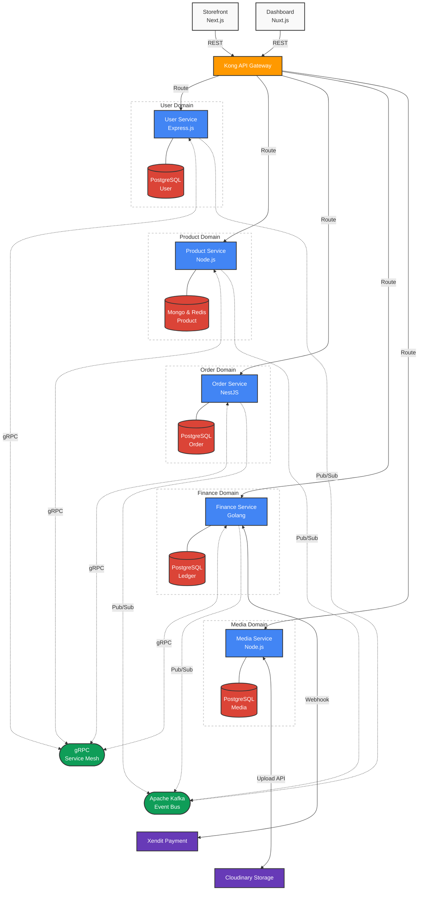

# High-Level Architecture (Topologi)

Sebuah sistem terdistribusi berskala besar harus memiliki batasan (*boundaries*) yang jelas antara titik masuk pengguna, lapisan komputasi, tulang punggung antrean pesan, dan ruang penyimpanan. 

Halaman ini memvisualisasikan bagaimana aliran data (*data flow*) bergerak dari *client* hingga ke *database* paling dalam, serta bagaimana setiap layanan G-NEXA saling berinteraksi secara sinkronus maupun asinkronus.

---

## Visualisasi Topologi Sistem

Berikut adalah diagram *High-Level Architecture* dari G-NEXA. Diagram ini membagi sistem ke dalam 5 lapisan utama: *Presentation, Edge/Gateway, Compute (Microservices), Event-Backbone,* dan *Persistence*.

## Anatomi Aliran Data

Untuk memahami topologi di atas, kita perlu membedah peran spesifik dari setiap lapisan saat menangani lalu lintas transaksi yang padat:

### 1. The Edge: Kong API Gateway
Kong bertindak sebagai satpam dan resepsionis tunggal. Tidak ada satupun perangkat dari luar (*browser*, aplikasi *mobile*, atau entitas tidak dikenal) yang bisa menyentuh *microservices* G-NEXA secara langsung. Kong menangani:
* **SSL Termination & Routing:** Mengarahkan rute eksternal seperti `/api/orders` ke *Order Service* dan `/api/products` ke *Product Service* di jaringan internal.
* **Rate Limiting:** Melindungi layanan dari serangan DDoS dan *spam request*.
* **Authentication Check:** Memverifikasi integritas JWT (JSON Web Token) di garis depan sebelum meneruskan *request* ke layanan komputasi.

### 2. Komunikasi Internal (The Network)
Saat *request* sudah masuk ke dalam *Compute Layer*, layanan memiliki dua jalur komunikasi utama:
* **Synchronous (gRPC):** Digunakan murni untuk kebutuhan validasi data instan antar-layanan (*read-heavy inter-service communication*). Contohnya, saat *Product Service* perlu memastikan keabsahan ID Toko ke *User Service* sebelum mengizinkan penambahan katalog baru, gRPC memfasilitasi ini dengan latensi nyaris nol.
* **Asynchronous (Kafka):** Digunakan untuk mengeksekusi alur bisnis utama (*write/mutation operations*) yang melintasi berbagai domain. Contohnya, proses *checkout* multi-toko tidak dilakukan dengan serangkaian panggilan HTTP yang rentan gagal (*cascading failure*). Alih-alih, *Order Service* mempublikasikan *event* ke Kafka, lalu *Finance Service* dan layanan lainnya akan mengonsumsi *event* tersebut secara mandiri untuk memotong saldo atau memanipulasi stok inventaris.

### 3. Isolasi Data (Database per Service)
Prinsip utama dalam arsitektur ini adalah melarang keras penggunaan basis data bersama (*shared database*).
* Tidak ada *Foreign Key* fisik di tingkat *database* yang menghubungkan tabel `Orders` dengan `Users`. Relasi tersebut dikelola di tingkat aplikasi.
* *Finance Service* mengelola buku besar transaksinya (*ledger*) di dalam PostgreSQL yang terisolasi ketat, sementara *Product Service* menyimpan puluhan ribu struktur metadata dinamisnya secara fleksibel di MongoDB.
* Isolasi absolut ini menjamin *fault isolation*: Jika *database Product Service* mengalami lonjakan beban beban pencarian dan melambat, performa mutasi *Finance Service* dan orkestrasi *Order Service* tidak akan terpengaruh sama sekali.

---

:::info Membedah Pilar Pembentuk
Dengan selesainya bab Gambaran Besar (Hulu) ini, Anda telah memahami fondasi teori, visi, tumpukan teknologi, dan topologi G-NEXA. Selanjutnya, kita akan turun satu level untuk membedah kode dan anatomi dari masing-masing layanan. 

Lanjutkan ke **[Pilar Pembentuk: User Service (Express.js)](/docs/components/user-service)**.
:::
