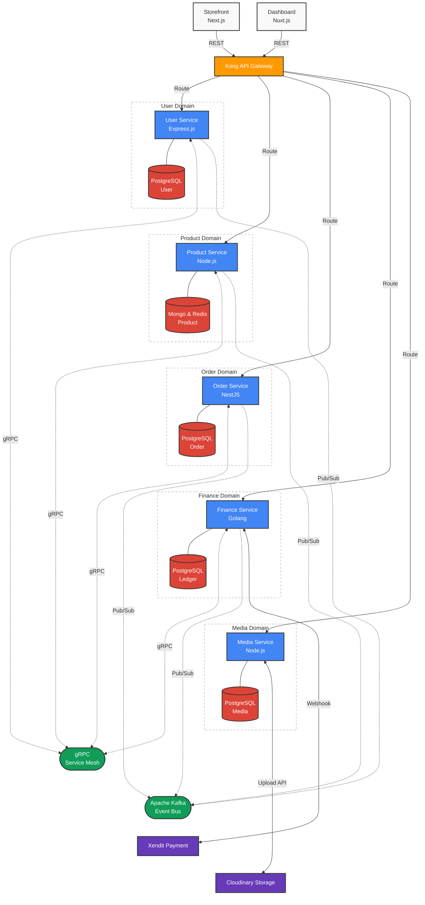

## Overview

**Live System Showcase And More Documentation:** [https://g-nexa-project-showcase.vercel.app/](https://g-nexa-project-showcase.vercel.app/)

**GitHub Repository (Copy URL):**
```text
https://github.com/muhammadwildanskyyy/G-NEXA.git
```

Designing systems that can scale infinitely while remaining maintainable is the ultimate challenge in backend engineering. **G-NEXA** is my solution to this challenge—a comprehensive, polyglot microservices ecosystem encompassing five specialized core domains: `Users`, `Product`, `Order`, `Finance`, and `Media`. 

Instead of relying on a monolithic structure, G-NEXA empowers each service to operate independently, written in the language best suited for its workload—ranging from compiled **Go** for high-throughput computations to **NestJS** and **Express.js** for rapid API domain logic. The entire infrastructure is orchestratable locally with a single `Taskfile` command via Docker containers.

## High-Level Topology & Flow

To ensure precise operational isolation, each layer's responsibilities are divided strictly across the Gateway, Compute nodes, and Backbones framework:



## Default Service Architecture & Features

- **Polyglot Ecosystem**: A diverse stack architecture where services are natively implemented in Go, NestJS, and Express.js based on domain-specific requirements, demonstrating deep proficiency across multiple modern backend ecosystems.
- **gRPC Inter-Service Communication**: Migrated exhaustive HTTP/REST server-to-server calls to highly optimized **gRPC protocols**. This guarantees sub-millisecond, type-safe data serialization between crucial modules like *Order* and *Finance*, drastically reducing cross-service payload overhead.
- **Event-Driven Architecture via Apache Kafka**: Implemented a robust asynchronous pub/sub messaging backbone utilizing **Apache Kafka** to decouple high-load cross-domain mutations. Instead of risking cascading failures during a multi-service operations (like checkout), services emit real-time events, significantly increasing the system's fault tolerance during traffic spikes.
- **Centralized Kong API Gateway**: Utilized **Kong** to manage internal and external routing prefixes safely, creating a unified entry point, masking microservice endpoints, and standardizing load balancing and rate limiting.
- **Global Redis Caching Layer**: Engineered an aggressive caching layer utilizing **Redis** with strategic 5-minute TTL configurations logic. Implemented directly in Go drivers, NestJS CacheModules, and Express `ioredis`, allowing read-heavy endpoints (like Product catalogs and User profiles) to offload immense database strain.
- **Hybrid Database Strategy**: Merged **PostgreSQL** relational integrity (for transactional states like Finance and Orders) with **MongoDB** flexibility, tailoring read-write paradigms explicitly for each microservice.

## The Engineering Challenge

The most complex hurdle during the development of G-NEXA was **service synchronization and payload performance**. Initially, services communicated via standard RESTful HTTP APIs. As the system grew, serialization overhead and network latency compounded into notable bottlenecks during synchronous chained requests (e.g., placing an `Order` which inherently triggers `Payment/Finance`, which alters `Product` inventory).

To mitigate this, I spearheaded a complete migration to **gRPC**. Generating strict Protobuf definitions ensured that our Go and Node-based environments passed binary-encoded data effortlessly, erasing the heavy JSON parsing loops. 

Additionally, maintaining state consistency across isolated **Microservices** (Database-per-Service) introduced complex transaction boundaries. By designing a distributed invalidation caching strategy through Redis, the application began capturing incoming writes and invalidating stale catalog reads instantly. For complex distributed transactions, I introduced an **Event-Driven Strategy** via Kafka implementing Saga patterns and idempotency keys to ensure that failed inter-domain events could safely retry without duplicating records. Operating these moving parts seamlessly required intricate Docker container meshing and route alignments inside the Kong Gateway, solidifying my expertise in modern distributed backend systems.
